# 企业级 Hermes AI 助理平台
## 完整系统方案 · 图文版

> **版本** v2.0 · **适用规模** 70 人 · **日期** 2026 年 5 月  
> **核心组件** Hermes Agent v0.12 · 钉钉 DingTalk · Claude Code · Codex CLI · Docker · Samba · Git

---

## 目录

1. [方案概述](#1-方案概述)
2. [整体系统架构](#2-整体系统架构)
3. [钉钉集成方案](#3-钉钉集成方案)
4. [四层 Profile 管理体系](#4-四层-profile-管理体系)
5. [Windows 工作目录映射](#5-windows-工作目录映射)
6. [编码智能体协同方案](#6-编码智能体协同方案)
7. [硬件部署方案](#7-硬件部署方案)
8. [概要预算](#8-概要预算)
9. [实施路线图](#9-实施路线图)
10. [运维与治理](#10-运维与治理)
11. [安全与合规](#11-安全与合规)
12. [附录](#12-附录)

---

## 1. 方案概述

### 1.1 背景与价值主张

本方案基于 Nous Research 开源框架 **Hermes Agent**（v0.12，2026 年 4 月 30 日发布，GitHub 90,000+ Stars），
为企业 **70 名员工** 提供每人一个专属、会进化的 AI 工作助理。

区别于传统 AI 对话工具，Hermes 的本质是一个具有**持久记忆 + 自我进化**能力的智能体运行时：

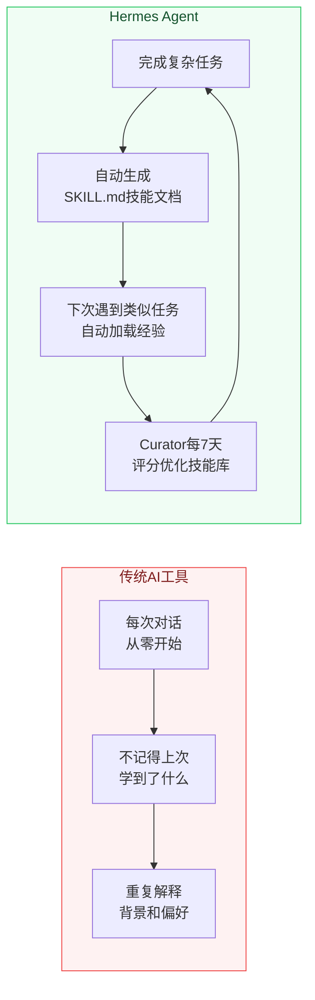

### 1.2 方案核心能力

| 能力维度 | 说明 | 企业价值 |
|---|---|---|
| **钉钉原生集成** | Stream Mode WebSocket，无需公网 URL | 零门槛使用，无需安装客户端 |
| **每员工独立助理** | Docker 容器隔离，独立记忆/技能/会话 | 个性化进化，互不干扰 |
| **四层技能治理** | 公司/域/角色/个人四层继承体系 | 知识沉淀，组织能力资产化 |
| **Windows 目录映射** | SMB 挂载 Z:\ 驱动器，双向实时读写 | AI 产出文件本地可见 |
| **编码智能体调度** | 协调 Claude Code + Codex 自动完成编码任务 | 开发效率倍增 |
| **私有化部署** | 数据不出企业，调用公共 LLM API | 数据主权 + 成本可控 |

### 1.3 不自建大模型的设计选择

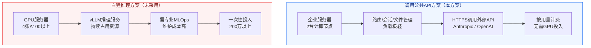

> **决策依据**：70 人规模下，自建推理的固定成本远高于 API 调用费用；且公共模型迭代速度快，无需跟随升级。当规模超过 500 人且有数据主权要求时，可重新评估混合方案。

---

## 2. 整体系统架构

### 2.1 全局架构总览

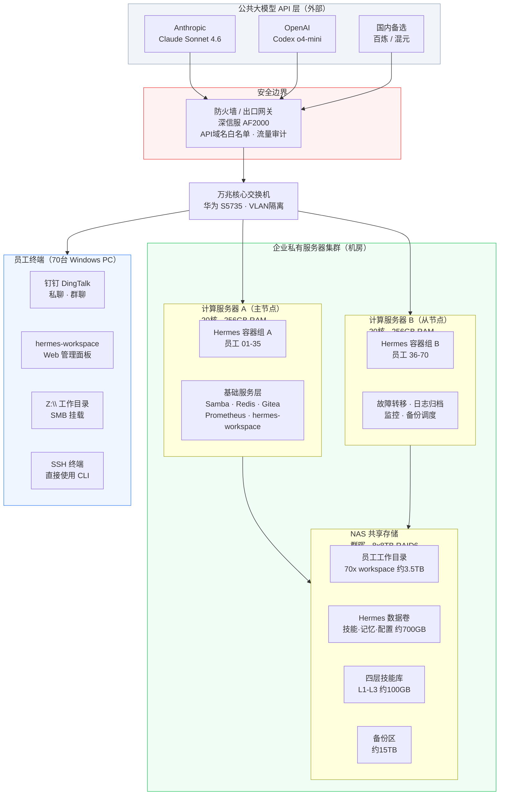

### 2.2 单员工容器内部结构

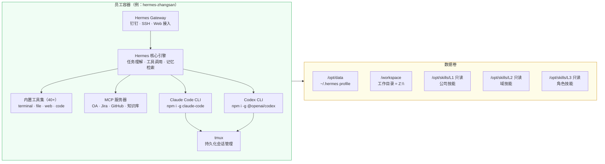

### 2.3 核心服务清单

| 服务 | 承载位置 | 作用 | 端口 |
|---|---|---|---|
| Hermes Gateway × 70 | 计算服务器 A/B | 每员工独立容器，接入钉钉 | 8701–8770 |
| Samba Server | 服务器 A | 暴露 NAS 数据卷为 SMB 共享 | 445/139 |
| Redis | 服务器 A | 会话路由缓存 | 6379 |
| Gitea | 服务器 A | 四层技能 Git 仓库 | 3000 |
| mission-control | 服务器 A | 多实例监控、成本追踪 | 3001 |
| hermes-workspace | 服务器 A | 员工 Web 管理面板（PWA）| 3002 |
| Prometheus | 服务器 B | 指标采集 | 9090 |
| Grafana | 服务器 B | 监控可视化、告警 | 3003 |
| Claude Code CLI | 每员工容器 | 编码智能体（Hermes 可调度）| — |
| Codex CLI | 每员工容器 | 测试/文档生成（Hermes 可调度）| — |

---

## 3. 钉钉集成方案

### 3.1 接入原理：Stream Mode

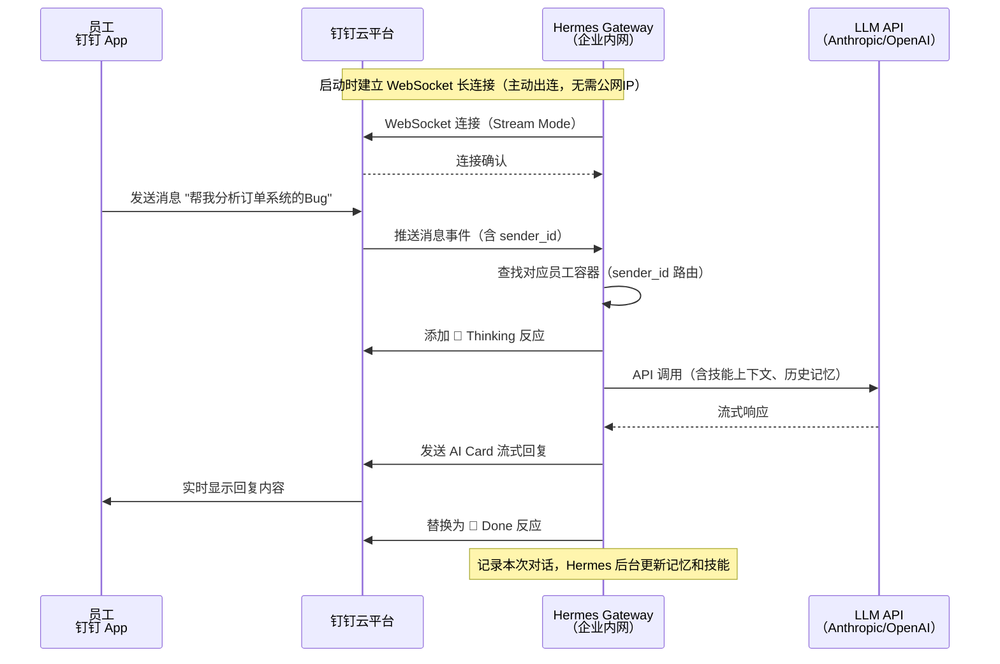

### 3.2 钉钉开发者后台配置步骤

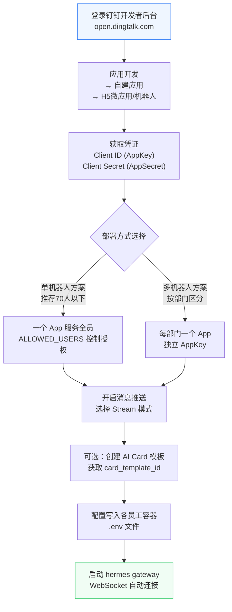

### 3.3 配置文件

```yaml
# ~/.hermes/config.yaml（每员工容器内）
platforms:
  dingtalk:
    enabled: true
    extra:
      card_template_id: "your-card-template-id"   # 启用 AI Cards 富文本
    display:
      streaming: true           # 流式输出，实时显示
      show_reasoning: false     # 不展示模型推理过程
    group_sessions_per_user: true   # 群聊中各用户上下文独立隔离
```

```bash
# .env（每员工容器独立，Samba 屏蔽此文件）
DINGTALK_CLIENT_ID=your-app-key
DINGTALK_CLIENT_SECRET=your-app-secret
# 仅授权用户可交互（多个用逗号分隔）
DINGTALK_ALLOWED_USERS=zhangsan_dingtalk_userid
```

### 3.4 交互行为规则

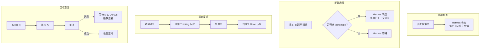

---

## 4. 四层 Profile 管理体系

### 4.1 层级架构

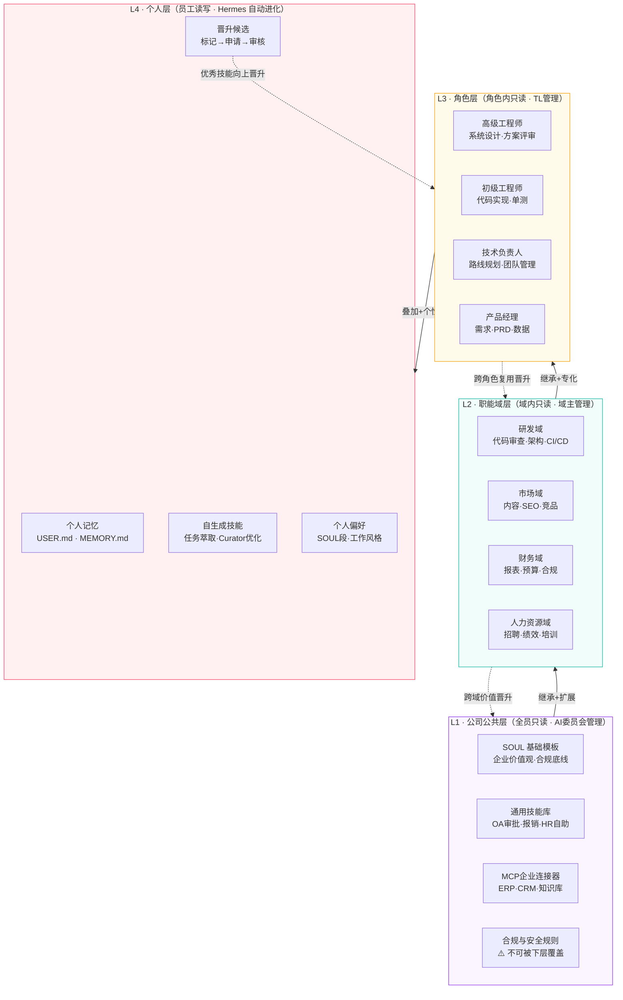

**覆盖优先级（高 → 低）**：`个人(L4)` > `角色(L3)` > `职能域(L2)` > `公司(L1)`

同名技能时，本地（L4）版本自动覆盖外部版本；SOUL.md 按段落合并，合规段不可覆盖。

### 4.2 目录结构

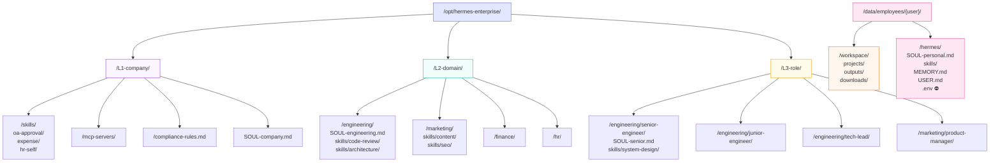

### 4.3 SOUL.md 四段合并机制

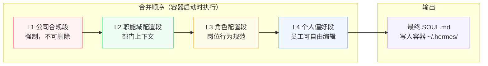

```bash
#!/bin/bash
# build_soul.sh - 容器启动时执行，自动合并四层 SOUL.md
EMPLOYEE=$1; DOMAIN=$2; ROLE=$3
OUTPUT="$HERMES_HOME/SOUL.md"

cat /L1/SOUL-company.md > "$OUTPUT"               # 段1：合规底线（强制）
cat /L2/$DOMAIN/SOUL-$DOMAIN.md >> "$OUTPUT"       # 段2：职能域
cat /L3/$DOMAIN/$ROLE/SOUL-$ROLE.md >> "$OUTPUT"   # 段3：角色
cat $HERMES_HOME/SOUL-personal.md >> "$OUTPUT"     # 段4：个人偏好
```

### 4.4 技能加载配置

```yaml
# config.yaml（由 provision 脚本根据 registry.yaml 自动生成）
skills:
  external_dirs:
    - /opt/skills/L1    # 公司层：只读，优先级最低
    - /opt/skills/L2    # 域层：只读
    - /opt/skills/L3    # 角色层：只读
  # L4 个人技能：~/.hermes/skills/（默认读写，同名自动覆盖外部版本）
```

### 4.5 技能晋升完整流程

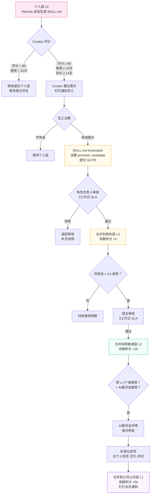

### 4.6 技能 SKILL.md 标准格式

```markdown
---
name: k8s-deployment-rollback
description: Kubernetes 部署回滚标准流程
category: devops
layer: L4-personal
promote: candidate          # null / candidate / approved / rejected
promote_target: L3-role
promote_reason: |
  团队内多人询问相同流程，值得标准化
promoted_by: zhangsan
curator_score: 87           # Curator 最近评分（满分 100）
uses_last_30d: 14
tags: [kubernetes, devops, 回滚, 运维]
version: 1.2.0
---

## 何时使用此技能
部署出现问题需要回滚到上一个稳定版本时。

## 执行步骤
1. 检查当前 deployment 状态 ...
```

---

## 5. Windows 工作目录映射

### 5.1 三层映射架构

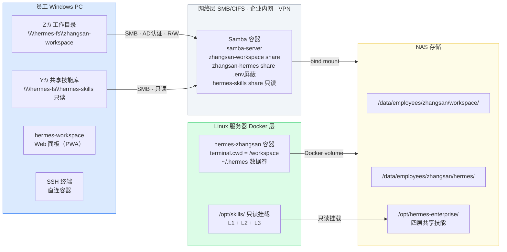

### 5.2 Windows 驱动器内容

```
Z:\ (\\hermes-fs\zhangsan-workspace)                [R/W]
├── workspace\
│   ├── projects\
│   │   ├── order-system\        ← Hermes 分析/编写的项目代码
│   │   └── q3-report\           ← AI 生成的报告
│   ├── outputs\                 ← Hermes 任务产出（文档/代码/分析）
│   │   ├── code-review-20260507.md
│   │   ├── market-analysis.xlsx
│   │   └── pr-draft.md
│   └── downloads\               ← Hermes 抓取的外部资料
│
└── hermes\                      [R/W，.env 和 config.yaml 被屏蔽]
    ├── SOUL-personal.md         ← 双击用 VSCode/记事本编辑人设
    ├── skills\                  ← 浏览/编辑 L4 个人技能
    │   ├── k8s-rollback\SKILL.md
    │   └── report-template\SKILL.md
    ├── MEMORY.md                ← 查看 Hermes 记住了什么
    └── USER.md                  ← 查看/编辑个人偏好

Y:\ (\\hermes-fs\hermes-skills)                      [R/O]
├── L1-company\                  ← 公司公共技能（只读参考）
├── L2-engineering\              ← 研发域技能（只读参考）
└── L3-senior-engineer\          ← 高级工程师技能（只读参考）
```

### 5.3 Samba 关键配置

```ini
[global]
   workgroup = COMPANY
   security = ADS
   realm = COMPANY.COM
   kernel change notify = yes    ; Windows 资源管理器实时刷新

[zhangsan-workspace]
   path = /mnt/employees/zhangsan/workspace
   valid users = zhangsan
   read only = no

[zhangsan-hermes]
   path = /mnt/employees/zhangsan/hermes
   valid users = zhangsan
   read only = no
   ; 关键：屏蔽 API 密钥和系统配置文件
   veto files = /.env/config.yaml/state.db/sessions/logs/
   hide files = /.*/

[hermes-skills]
   path = /mnt/skills
   valid users = @domain-staff
   read only = yes
```

### 5.4 Windows 自动挂载（GPO）

```powershell
# 由 IT 通过组策略推送，员工登录时自动执行
$user   = $env:USERNAME
$server = "hermes-fs.company.com"

# Z: 个人工作目录（R/W）
New-PSDrive -Name "Z" -PSProvider FileSystem `
    -Root "\\$server\$user-workspace" -Persist -Scope Global

# Y: 共享技能库（R/O，可选）
New-PSDrive -Name "Y" -PSProvider FileSystem `
    -Root "\\$server\hermes-skills" -Persist -Scope Global

Write-Host "Hermes 工作目录已挂载 → Z:\" -ForegroundColor Green
```

### 5.5 文件权限矩阵

| 文件/目录 | Windows 可见 | Windows 可写 | 说明 |
|---|---|---|---|
| `workspace/` | ✅ | ✅ | 核心工作区，双向读写 |
| `hermes/SOUL-personal.md` | ✅ | ✅ | 员工可自定义个人人设 |
| `hermes/skills/` | ✅ | ✅ | L4 个人技能，可浏览编辑 |
| `hermes/USER.md` | ✅ | ✅ | 个人记忆，可查看修改 |
| `hermes/MEMORY.md` | ✅ | ✅ | Hermes 记忆，可查看 |
| `hermes/.env` | ❌ | ❌ | Samba `veto files` 屏蔽 |
| `hermes/config.yaml` | ❌ | ❌ | IT 托管，不暴露 |
| `hermes/state.db` | ❌ | ❌ | SQLite 会话库，屏蔽 |
| `hermes/sessions/` | ❌ | ❌ | 对话历史，屏蔽 |
| `skills/L1-L3/`（Y:\）| ✅ | ❌ | 只读挂载，可浏览参考 |

---

## 6. 编码智能体协同方案

### 6.1 三智能体角色分工

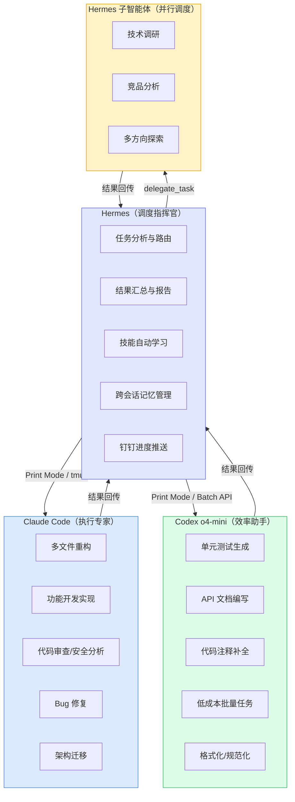

### 6.2 智能路由决策树

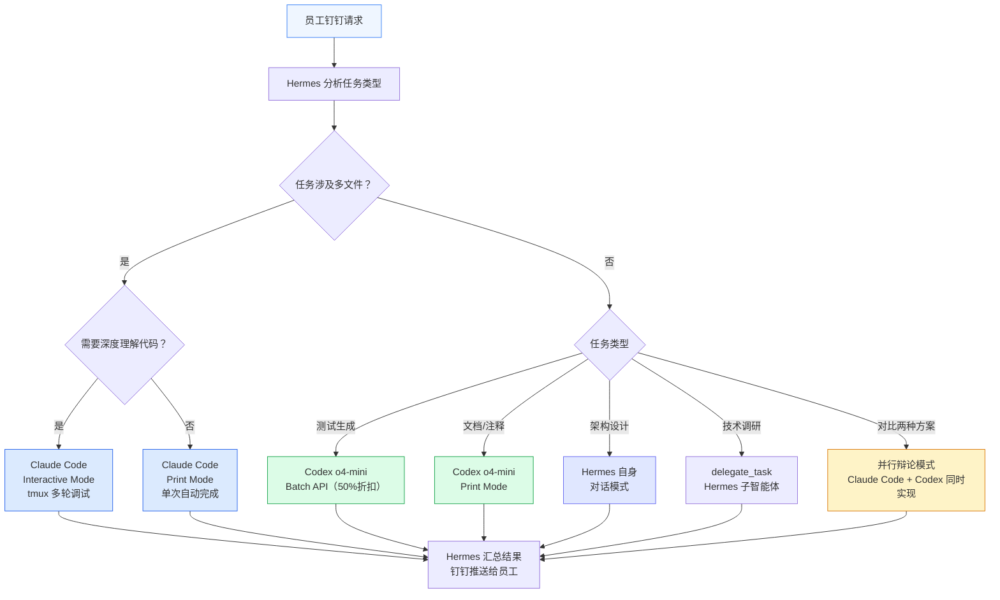

### 6.3 四种调度模式详解

#### 模式一：Print Mode — 自动化单次任务

最常用模式，无需交互，Hermes 直接调用并获取结果。

```bash
# Claude Code Print Mode（Hermes 内部执行）
claude -p "Fix null pointer exception in src/order/processor.py. \
           Add error handling and a pytest unit test." \
  --allowedTools 'Read,Write,Edit,Bash' \
  --max-turns 15 \
  --max-budget-usd 2.0

# Codex Print Mode（安静模式）
codex -q "Generate comprehensive pytest tests for src/order/processor.py. \
          Mock all external dependencies." \
  --model o4-mini \
  --approval-mode full-auto
```

#### 模式二：tmux 交互模式 — 多轮对话调试

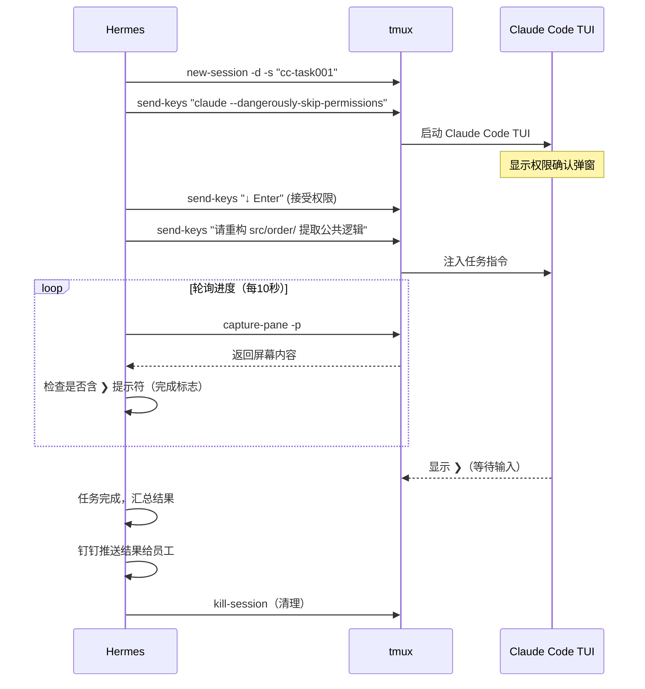

#### 模式三：并行辩论模式 — 双智能体对比

```python
# Hermes delegate_task 并行调用
delegate_task(tasks=[
    {
        "goal": """Claude Code 实现订单状态机
                   文件: src/order/state_machine.py
                   状态: pending→paid→shipped→cancelled
                   要求: 含验证逻辑和异常处理""",
        "tools": ["terminal"],
        "context": "branch=cc-impl"
    },
    {
        "goal": """Codex 实现同样的订单状态机
                   相同规格，独立实现""",
        "tools": ["terminal"],
        "context": "branch=codex-impl"
    }
])
# → Hermes 对比两份实现：代码质量、测试覆盖率、可读性
# → 选择最优方案或融合两者优点，合并到 main
```

#### 模式四：流水线模式 — 全流程自动化

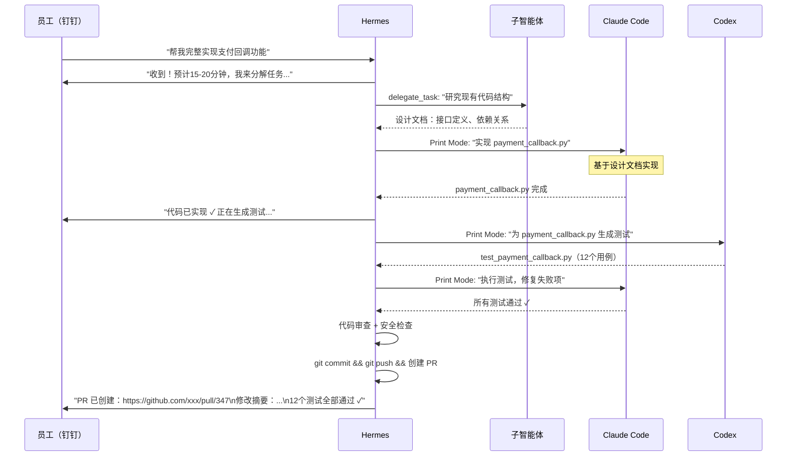

### 6.4 预算控制与安全规则

```yaml
# config.yaml 编码智能体安全边界
coding_agents:
  claude_code:
    max_budget_usd: 5.0           # 单次任务最高 $5
    max_turns: 30                 # 最大交互轮次
    allowed_tools: [Read, Write, Edit, Bash]
    denied_commands:              # 危险命令黑名单
      - "rm -rf"
      - "DROP TABLE"
      - "git push --force"
      - "chmod 777"
    require_dingtalk_approval:    # 高危操作需钉钉员工二次确认
      - "git push"
      - "kubectl apply"
      - "docker deploy"

  codex:
    max_tokens: 80000
    approval_mode: full-auto
    use_batch_api: true           # 非实时任务启用 Batch API（50%折扣）

  hermes_subagent:
    max_delegation_depth: 3       # 子智能体最多嵌套 3 层
    timeout_seconds: 900
```

---

## 7. 硬件部署方案

### 7.1 资源需求分析

> **核心前提**：不运行本地大模型，服务器仅处理路由、文件 I/O 和会话管理，CPU/内存负载极低。

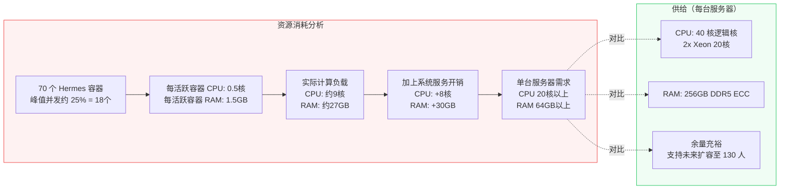

### 7.2 物理拓扑

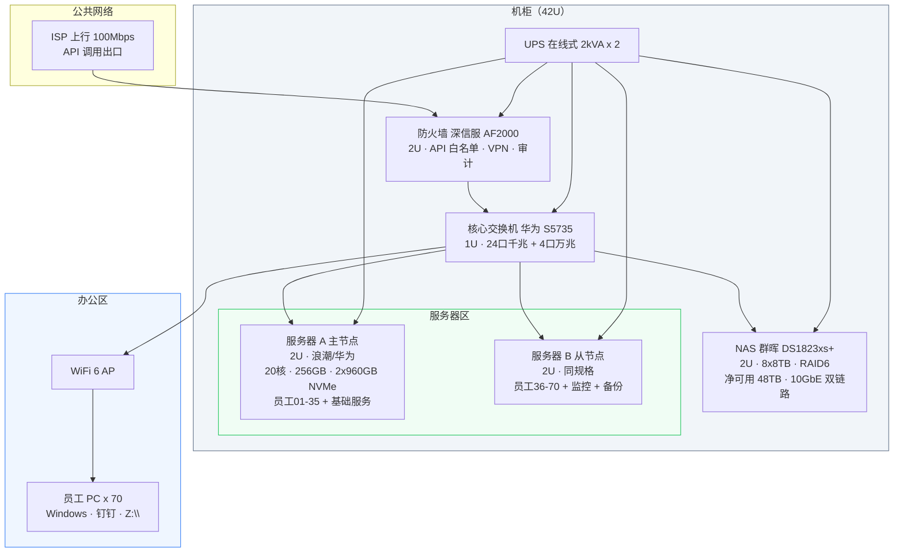

### 7.3 硬件清单

#### 计算服务器（× 2 台，规格相同）

| 配置项 | 规格 | 备注 |
|---|---|---|
| 机型参考 | 浪潮 NF5180M7 / 华为 FusionServer Pro 2288H V7 | 2U 机架式 |
| CPU | 2× Intel Xeon Silver 4416+（20C/40T，2.0GHz）| 总 40 核，无需高频 |
| 内存 | 256GB DDR5 ECC（16× 16GB）| 支持扩展至 512GB |
| 系统盘 | 2× 960GB NVMe SSD（RAID 1）| OS + Docker 镜像 |
| 网卡 | 2× 10GbE SFP+（上联 + 心跳）| |
| 远程管理 | IPMI / iDRAC（带外管理）| |
| 电源 | 2× 800W 冗余热插拔 | |
| 单台报价 | **¥40,000–50,000** | 含 3 年硬件维保 |

#### NAS 存储服务器

| 配置项 | 规格 |
|---|---|
| 机型 | 群晖 DS1823xs+ 或 QNAP TS-873A |
| 硬盘 | 8× 8TB 西数 Red Pro 企业级（RAID 6，净可用 48TB）|
| 接口 | 10GbE × 2（双链路聚合至交换机）|
| 用途分配 | 工作目录 3.5TB + Hermes 数据 700GB + 技能 100GB + 备份 15TB + 余量 |
| 报价 | **¥8,000（机身）+ ¥4,800（8×8TB）= ¥12,800** |

#### 网络与基础设施

| 设备 | 型号 | 参考价 |
|---|---|---|
| 核心交换机 | 华为 S5735-L24T4X-A（24口千兆+4口万兆）| ¥6,000–8,000 |
| 防火墙 | 深信服 AF2000-A（含3年授权+VPN）| ¥18,000–22,000 |
| UPS 在线式 | 山特 3C3 Pro 2kVA × 2 台 | ¥5,000–6,000/台 |
| 机柜 + 布线 | 42U 标准机柜 + PDU + 跳线 | ¥6,000–8,000 |

### 7.4 高可用容灾方案

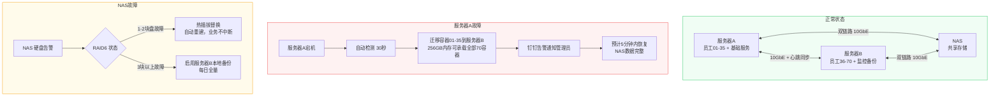

---

## 8. 概要预算

### 8.1 一次性投入

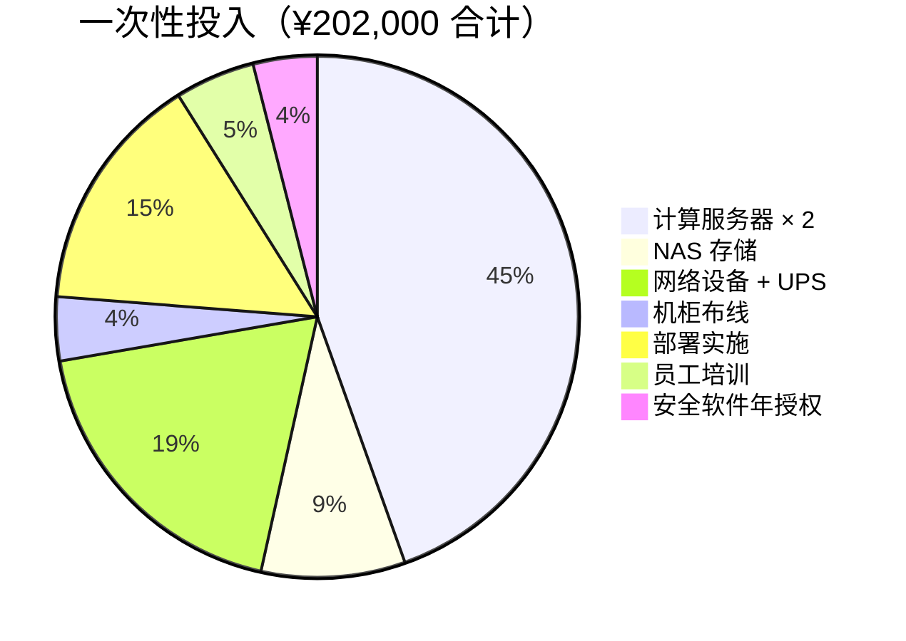

### 8.2 月度 API 费用拆解

> 基准：70 人，30 名开发者；Claude Sonnet 4.6 $3/$15/M tokens；汇率 7.3

```mermaid
pie title 月度API费用（优化后 ≈ ¥20,000/月）
    "Claude Code（30开发者）" : 13000
    "Hermes日常对话（70人）" : 3500
    "Codex o4-mini（测试/文档）" : 3500
```

| 费用项 | 未优化月费 | 优化后月费 | 主要优化手段 |
|---|---|---|---|
| Hermes 日常对话 | ¥10,000 | ¥3,500 | 提示词缓存（70% 节省）+ Haiku/Sonnet 混合 |
| Claude Code | ¥53,000 | ¥13,000 | Team 订阅（$100/seat）或 API 限流控制 |
| Codex o4-mini | ¥12,000 | ¥3,500 | Batch API（50% 折扣）|
| **合计** | **¥75,000** | **¥20,000** | **节省 73%** |

### 8.3 年度总拥有成本（TCO）

```mermaid
flowchart LR
    subgraph Year1["Year 1（含建设期）"]
        Y1H["硬件+实施<br/>202,000元<br/>一次性"]
        Y1A["API费用<br/>240,000元<br/>20,000x12"]
        Y1O["运维维保<br/>20,000元"]
        Y1T["合计<br/>约462,000元"]
    end

    subgraph Year2["Year 2+（纯运营）"]
        Y2A["API费用<br/>240,000元"]
        Y2O["运维维保<br/>20,000元"]
        Y2T["合计<br/>约260,000元"]
    end

    subgraph PerEmp["人均月成本"]
        PE1["Year 1<br/>550元/人/月"]
        PE2["Year 2+<br/>310元/人/月"]
    end

    Y1H & Y1A & Y1O --> Y1T
    Y2A & Y2O --> Y2T
    Y1T --> PE1
    Y2T --> PE2

    style Year1 fill:#eff6ff,stroke:#3b82f6
    style Year2 fill:#f0fdf4,stroke:#22c55e
    style PerEmp fill:#faf5ff,stroke:#8b5cf6
```

### 8.4 成本优化路径

```mermaid
graph LR
    BASE["基准月费<br/>¥75,000"]

    BASE -->|"提示词缓存<br/>-65%重复输入"| L1O["¥47,000"]
    L1O -->|"Haiku替代Sonnet<br/>简单任务-67%"| L2O["¥35,000"]
    L2O -->|"Batch API<br/>非实时任务-50%"| L3O["¥27,000"]
    L3O -->|"Claude Code Team订阅<br/>$100/seat固定封顶"| L4O["¥20,000"]
    L4O -->|"国内模型替代<br/>非编码Hermes对话"| L5O["¥16,000"]

    style BASE fill:#fef2f2,stroke:#ef4444
    style L5O fill:#f0fdf4,stroke:#22c55e
```

---

## 9. 实施路线图

```mermaid
gantt
    title Hermes 企业平台实施计划（8周）
    dateFormat  YYYY-MM-DD
    axisFormat  %m/%d

    section 阶段一：基础设施
    服务器上架与系统安装         :a1, 2026-05-11, 3d
    网络配置（交换机/防火墙）     :a2, after a1, 2d
    NAS初始化与挂载              :a3, after a1, 2d
    Docker环境搭建               :a4, after a2, 2d
    基础监控上线                 :a5, after a4, 2d

    section 阶段二：平台部署
    Hermes镜像构建（含CC/Codex） :b1, 2026-05-25, 3d
    Gitea初始化+四层技能入库      :b2, after b1, 3d
    种子用户容器创建（5人）       :b3, after b1, 2d
    钉钉接入验证                 :b4, after b3, 1d
    Windows GPO+Z盘挂载测试      :b5, after b3, 2d
    hermes-workspace上线         :b6, after b2, 2d

    section 阶段三：试点验证
    10人跨部门试点               :c1, 2026-06-08, 5d
    SOUL.md域模板定制            :c2, 2026-06-08, 4d
    Claude Code+Codex联调        :c3, after c1, 3d
    MCP服务器接入                :c4, after c1, 4d
    安全审计与成本告警配置        :c5, after c3, 2d
    试点报告与优化               :c6, after c4, 2d

    section 阶段四：全员上线
    批量开通剩余60名员工          :d1, 2026-06-22, 3d
    员工分批培训（2h/组）         :d2, 2026-06-22, 5d
    API费用日报配置              :d3, after d1, 1d
    Curator机制验证              :d4, 2026-06-29, 3d
    全员上线复盘                 :d5, 2026-07-01, 2d
```

### 9.1 各阶段关键验收标准

```mermaid
flowchart LR
    subgraph P1["阶段一验收"]
        A1["服务器 ping 通<br/>Docker 运行正常<br/>NAS 挂载可读写<br/>UPS 供电测试通过"]
    end
    subgraph P2["阶段二验收"]
        A2["5人容器正常运行<br/>钉钉消息收发正常<br/>Z: 驱动器自动挂载<br/>Web面板可访问"]
    end
    subgraph P3["阶段三验收"]
        A3["10人试点满意度80%以上<br/>Claude Code 调度成功<br/>API成本监控上线<br/>无安全问题"]
    end
    subgraph P4["阶段四验收"]
        A4["全部70容器运行<br/>员工培训完成<br/>Curator首次自动优化<br/>月度成本在预算内"]
    end

    P1 --> P2 --> P3 --> P4

    style A1 fill:#f0fdf4,stroke:#22c55e
    style A2 fill:#f0fdf4,stroke:#22c55e
    style A3 fill:#f0fdf4,stroke:#22c55e
    style A4 fill:#f0fdf4,stroke:#22c55e
```

---

## 10. 运维与治理

### 10.1 日常运维流程

```mermaid
flowchart LR
    subgraph DAILY["每日"]
        D1["自动备份<br/>NAS→服务器B"] --> D2["API成本日报<br/>钉钉推送管理员"]
        D2 --> D3["容器健康检查<br/>Grafana告警"]
    end

    subgraph WEEKLY["每周"]
        W1["Curator自动优化<br/>技能库评分/修剪"] --> W2["技能晋升候选<br/>通知员工"]
        W2 --> W3["安全日志审查"]
    end

    subgraph MONTHLY["每月"]
        M1["AI委员会例会<br/>技能晋升审核"] --> M2["API成本复盘<br/>优化模型路由"]
        M2 --> M3["硬件健康报告"]
    end

    subgraph QUARTERLY["每季度"]
        Q1["技能质量全量报告"] --> Q2["员工满意度调查"]
        Q2 --> Q3["安全渗透测试"]
    end

    DAILY --> WEEKLY --> MONTHLY --> QUARTERLY
```

### 10.2 常用运维命令

```bash
# ── 容器管理 ──
docker compose ps                                    # 查看所有容器状态
docker compose restart hermes-zhangsan               # 重启单个容器
docker compose pull && docker compose up -d          # 批量更新所有容器
docker compose logs -f hermes-zhangsan --tail 100    # 实时日志

# ── 新增员工 ──
./provision_employee.sh zhangsan zhangsan_dd_id 8701 9201

# ── 诊断调试 ──
docker exec hermes-zhangsan hermes doctor            # 环境诊断
docker exec hermes-zhangsan hermes gateway status    # 钉钉连接状态
docker exec hermes-zhangsan hermes debug share       # 上传调试报告

# ── 技能管理 ──
docker exec hermes-zhangsan hermes skills list       # 列出所有技能
docker exec hermes-zhangsan hermes update            # 更新 Hermes 版本

# ── 备份与恢复 ──
docker exec hermes-zhangsan hermes backup            # 备份配置和数据
docker exec hermes-zhangsan hermes import backup.zip # 从备份恢复
```

### 10.3 故障排查手册

```mermaid
flowchart TD
    FAULT["员工反馈问题"] --> Q1{"问题类型"}

    Q1 --> |"钉钉无响应"| D1["检查容器日志<br/>docker logs hermes-xxx"]
    D1 --> D2{"日志是否显示<br/>Connected？"}
    D2 --> |"否"| D3["检查 DINGTALK_CLIENT_ID<br/>验证 App 是否停用"]
    D2 --> |"是"| D4["检查 ALLOWED_USERS 设置<br/>确认员工钉钉ID正确"]

    Q1 --> |"Z盘无法挂载"| S1["Windows 事件查看器<br/>→ SMB 相关错误"]
    S1 --> S2{"是否有 AD 认证问题？"}
    S2 --> |"是"| S3["重新加入域<br/>或使用本地账户"]
    S2 --> |"否"| S4["net use Z: /delete<br/>重新执行挂载脚本"]

    Q1 --> |"API报错限流429"| R1["查看 Grafana<br/>API 请求速率面板"]
    R1 --> R2["调低并发限制<br/>或申请提升配额"]

    Q1 --> |"服务器A宕机"| F1["IPMI/iDRAC 远程诊断"]
    F1 --> F2["执行故障转移脚本<br/>./failover.sh A→B"]
    F2 --> F3["钉钉通知全员<br/>预计5分钟恢复"]
```

### 10.4 AI 治理委员会

```mermaid
flowchart TD
    subgraph MEMBERS["委员会组成"]
        CTO2["CTO（主席）"]
        IT2["IT 负责人"]
        LEGAL2["法务代表"]
        SEC2["安全负责人"]
        REP2["各域代表<br/>研发/市场/财务"]
    end

    subgraph DUTIES["定期职责"]
        MTG["每月例会（每月第一周一）<br/>· 技能晋升审批（域到公司层）<br/>· API成本复盘<br/>· 安全事件处理"]
        QTR["每季度<br/>· L1合规底线审计<br/>· 技能质量全量报告<br/>· 安全渗透测试"]
        YLY["每年<br/>· 硬件更新评估<br/>· 大模型升级规划<br/>· 全年ROI评估"]
    end

    CTO2 & IT2 & LEGAL2 & SEC2 & REP2 --> MTG & QTR & YLY
```

---

## 11. 安全与合规

### 11.1 安全架构分层

```mermaid
flowchart TB
    subgraph NET_SEC["网络层安全"]
        FWL["防火墙出口白名单<br/>仅放行 api.anthropic.com<br/>api.openai.com · npmjs.org"]
        VPN["VPN 接入<br/>员工外出时加密隧道"]
        VLAN["VLAN 隔离<br/>服务器区与办公区分离"]
    end

    subgraph APP_SEC["应用层安全"]
        CONTAINER["Docker 沙箱<br/>只读根文件系统<br/>所有Linux能力已移除<br/>PID 限制防 Fork Bomb"]
        SAMBA_SEC["Samba 权限控制<br/>veto files 屏蔽 .env<br/>valid users 精确授权"]
        ALLOWED["DINGTALK_ALLOWED_USERS<br/>精确控制可交互员工"]
    end

    subgraph DATA_SEC["数据安全"]
        LOCAL["数据本地化<br/>对话历史存储在企业服务器"]
        ENCRYPT["传输加密<br/>HTTPS/TLS 1.3"]
        KEY["密钥隔离<br/>每容器独立 .env<br/>Windows 完全不可见"]
    end

    subgraph AI_SEC["AI行为安全"]
        COMPLIANCE["合规底线<br/>L1层强制段，不可覆盖"]
        APPROVAL["命令审批<br/>危险操作需钉钉二次确认"]
        BUDGET["预算限制<br/>max_budget_usd 单次上限"]
    end

    style NET_SEC fill:#fef2f2,stroke:#ef4444
    style APP_SEC fill:#fffbeb,stroke:#f59e0b
    style DATA_SEC fill:#eff6ff,stroke:#3b82f6
    style AI_SEC fill:#f0fdf4,stroke:#22c55e
```

### 11.2 合规要求矩阵

| 合规项 | 要求 | 实现方式 | 验证方法 |
|---|---|---|---|
| 数据本地化 | 对话数据不出企业 | 私有部署 + 无云存储 | 防火墙出口日志审查 |
| 操作审计 | 关键操作可追溯 | Hermes 日志 + 防火墙日志 | 月度日志抽样审查 |
| 敏感信息过滤 | 禁止存储个人敏感数据 | L1 合规底线规则 | 季度合规检查 |
| 最小权限 | 仅授权用户可交互 | ALLOWED_USERS 精确控制 | 定期账号审计 |
| 代码执行隔离 | AI 代码执行不影响主机 | Docker 沙箱隔离 | 渗透测试 |
| 密钥保护 | API 密钥不泄露 | Samba veto files | 安全扫描工具 |

---

## 12. 附录

### 附录 A：数据关系模型

```mermaid
erDiagram
    EMPLOYEE {
        string user_id PK
        string name
        string dingtalk_id
        string domain
        string role
        int container_port
        timestamp created_at
    }

    SKILL {
        string skill_id PK
        string name
        string category
        string layer
        string promote_status
        int curator_score
        int uses_30d
        string owner_user_id FK
        timestamp updated_at
    }

    SESSION {
        string session_id PK
        string user_id FK
        string platform
        timestamp started_at
        float api_cost_usd
    }

    MEMORY {
        string memory_id PK
        string user_id FK
        string type
        string content
        timestamp created_at
    }

    EMPLOYEE ||--o{ SKILL : "个人拥有(L4)"
    EMPLOYEE ||--o{ SESSION : "产生"
    EMPLOYEE ||--o{ MEMORY : "积累"
    SKILL ||--o{ SKILL : "晋升到上层"
```

### 附录 B：快速参考命令

```bash
# ── 员工开通 ──
./provision_employee.sh <用户名> <钉钉ID> <网关端口> <面板端口>

# ── 员工钉钉常用指令（员工直接发送给 Hermes）──
/skills          # 查看可用技能列表
/memory          # 查看 Hermes 的记忆
/new             # 开启新会话
/fast            # 切换快速模式（Claude 优先队列）
/compress        # 压缩上下文（节省 Token）
/personality 简洁  # 临时切换回复风格

# ── 常用工作指令示例 ──
"帮我分析 Z:\workspace\projects\xxx 的代码质量"
"用 Claude Code 修复 order-system 里的 Bug 并提 PR"
"起草一封向客户解释延期的邮件，语气诚恳"
"生成今天的工作日报并发送给我"
"搜索 React 19 最新发布说明，总结关键变化"
"帮我分析这张截图里的错误日志"
```

### 附录 C：API 定价参考（2026 年 5 月）

| 模型 | 输入 | 输出 | 缓存读取 | 推荐用途 |
|---|---|---|---|---|
| Claude Opus 4.7 | $5.00/M | $25.00/M | $0.50/M | 最复杂推理任务 |
| Claude Sonnet 4.6 | $3.00/M | $15.00/M | $0.30/M | 生产主力（1M上下文）|
| Claude Haiku 4.5 | $1.00/M | $5.00/M | $0.10/M | 高频轻量任务 |
| Codex o4-mini | $1.10/M | $4.40/M | — | 测试/文档生成 |
| GPT-5.2 | $1.75/M | $14.00/M | — | OpenAI 备选 |

> Batch API 所有模型享受 **50% 折扣**（异步处理，24小时内返回）。  
> 提示词缓存使重复输入成本降至标准价格的 **10%**（节省 90%）。

### 附录 D：关键参考资源

| 资源 | 地址 |
|---|---|
| Hermes Agent 官方文档 | https://hermes-agent.nousresearch.com/docs |
| 钉钉集成文档 | https://hermes-agent.nousresearch.com/docs/user-guide/messaging/dingtalk |
| 技能开放标准（agentskills.io）| https://agentskills.io |
| 多实例管理面板 | https://github.com/builderz-labs/mission-control |
| Web 工作台 | https://github.com/outsourc-e/hermes-workspace |
| ACP 多智能体技能 | https://github.com/Rainhoole/hermes-agent-acp-skill |
| Anthropic API 定价 | https://platform.claude.com/docs/en/about-claude/pricing |
| Hermes 生态地图 | https://hermesatlas.com |

---

*本文档基于 Hermes Agent v0.12（2026年4月30日发布）整理。API 定价以 Anthropic/OpenAI 官方页面实时数据为准。*
